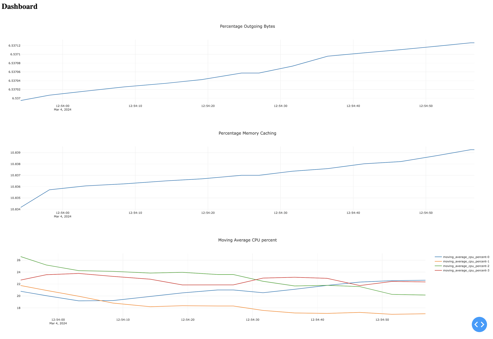

# Project 3: Serverless Computing and Monitoring Dashboard

## Task 1: Serverless Function and Runtime

In Task 1, I use `serverless_function.py` to process periodic measurements of resource usage. I deployed the pyfile ConfigMap using `pyfile.yml`, and the outputkey ConfigMap using `outputkey.yml`.

To ensure accurate computation of the moving average, I maintained a historical record of CPU utilization over the past minute in a variable called context. By appending the current CPU utilization to context and preserving a one-minute history, I prevented the context from becoming excessively large. The moving average was then calculated using this one-minute history.

## Task 2: Monitoring Dashboard

For Task 2, I employed Plotly Dash to develop a monitoring dashboard.



The dashboard refreshes every 5 seconds and visualizes three metrics obtained from the serverless function implemented in Task 1. As depicted in the images, the server exhibits a consistent load pattern, as these metrics display minimal fluctuations over time.

## Task 3: Serverless Runtime

I created a customized version of the serverless runtime with additional features.

The serverless runtime reads environment variables to retrieve the Redis Input Key and Redis Monitoring Period. Furthermore, it allows for the specification of a different entry function name.

To enable the use of zipped Python modules, I loaded the Zip file through the ConfigMap using the following command:
```
kubectl create configmap zip_module --from-file=zipped-module=serverless_function.zip --dry-run=client -o yaml
```

I appended `sys.path` with the directory where the Python file is located or the path to the zip file. Subsequently, I used the `importlib` library in Python to dynamically import the module. 

This serverless runtime remains compatible with the original runtime implementation.
